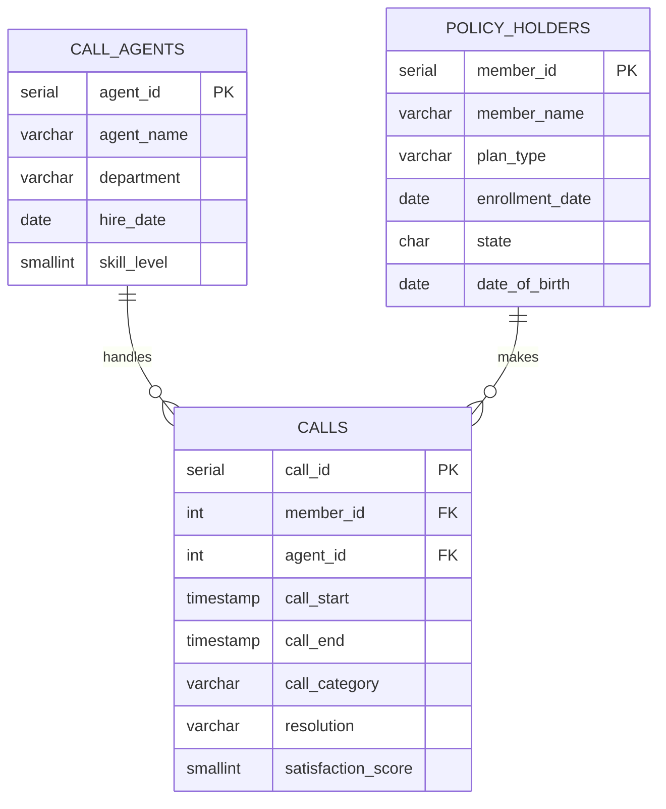

# Healthcare Call Center Analytics — Advanced SQL Case Study

A portfolio project demonstrating advanced SQL proficiency through a realistic healthcare call center dataset modeled after programs like UnitedHealth Group's Advocate4Me.

## Project Overview

This case study contains 10 progressively challenging analysis questions against a synthetic healthcare call center dataset (495 calls, 150 members, 25 agents across 6 months). Every query is annotated with the business question it answers, the SQL techniques it demonstrates, and an optimization rationale explaining *why* a particular approach was chosen over alternatives.

**Target audience:** Data analytics, data science, and ML engineering interviews where SQL proficiency is assessed.

**SQL dialect:** PostgreSQL 16+

## Dataset Description

| Table | Rows | Description |
|---|---|---|
| `call_agents` | 25 | Agents across 3 departments (Claims, Benefits, Enrollment) with skill levels 1–5 |
| `policy_holders` | 150 | Members with HMO/PPO/EPO/HDHP plans across 15+ states, ages 22–80 |
| `calls` | 495 | Call records from Jan–Jun 2024 with timestamps, categories, resolutions, and satisfaction scores |

### Intentional Edge Cases

The dataset includes realistic data quality challenges you'd encounter in production:

- **NULL values:** ~8% of `satisfaction_score` fields (survey not completed) and `resolution`/`call_end` on abandoned calls
- **Same-day duplicates:** Members 12 and 50 each have two calls on the same day
- **Repeat callers:** Member 1 (Alice Monroe) has 18 calls across 6 months with varied gaps (1-day, 5-day, 7-day, 14-day, 24-day)
- **Agent with zero calls:** Agent 25 (Natasha Volkov) was hired Jun 2023 and only has 3 calls in June — tests LEFT JOIN behavior
- **Irregular time gaps:** Call spacing ranges from same-day to 30+ day gaps for testing window function boundaries

## Schema Diagram



## Setup

```bash
# Create database and load schema + seed data
createdb callcenter
psql callcenter -f schema/create_tables.sql

# Verify row counts
psql callcenter -c "
  SELECT 'call_agents' AS tbl, COUNT(*) FROM call_agents
  UNION ALL SELECT 'policy_holders', COUNT(*) FROM policy_holders
  UNION ALL SELECT 'calls', COUNT(*) FROM calls;
"
# Expected: 25 agents, 150 policy_holders, 495 calls
```

## Analysis Questions

| # | File | Difficulty | Business Question | Key SQL Techniques |
|---|---|---|---|---|
| 1 | [`q01_monthly_volume_pivot.sql`](queries/q01_monthly_volume_pivot.sql) | ★☆☆☆☆ | Monthly call volume by category (pivot report) | `CASE` inside `COUNT`, `DATE_TRUNC`, conditional aggregation |
| 2 | [`q02_agent_ranking.sql`](queries/q02_agent_ranking.sql) | ★★☆☆☆ | Rank agents by first-call resolution rate | `RANK`, `DENSE_RANK`, `ROW_NUMBER`, `PARTITION BY` |
| 3 | [`q03_repeat_callers_7day.sql`](queries/q03_repeat_callers_7day.sql) | ★★★☆☆ | Identify repeat callers within 7 days | `LAG` with partitioning, interval arithmetic, CTE for window filter |
| 4 | [`q04_shift_analysis.sql`](queries/q04_shift_analysis.sql) | ★★★☆☆ | Call performance by shift (time-of-day bucketing) | `EXTRACT(HOUR)`, `EXTRACT(ISODOW)`, `NTILE`, `FILTER` clause, `PERCENTILE_CONT` |
| 5 | [`q05_agent_vs_dept_avg.sql`](queries/q05_agent_vs_dept_avg.sql) | ★★★☆☆ | Agent performance vs. department average | Self-join via CTEs, correlated subquery (comparison), threshold flagging |
| 6 | [`q06_rolling_trends.sql`](queries/q06_rolling_trends.sql) | ★★★★☆ | Rolling 30-day call volume and satisfaction | `SUM() OVER` running total, `AVG() OVER` with `ROWS BETWEEN`, `LEAD`, `generate_series` gap-fill |
| 7 | [`q07_set_operations.sql`](queries/q07_set_operations.sql) | ★★★★☆ | Caller segmentation with set logic | `EXCEPT`, `INTERSECT`, `EXISTS` vs `IN` with explanation |
| 8 | [`q08_recursive_call_chains.sql`](queries/q08_recursive_call_chains.sql) | ★★★★★ | Build repeat-caller chains (consecutive calls ≤7 days apart) | `WITH RECURSIVE`, gaps-and-islands alternative, `DISTINCT ON` |
| 9 | [`q09_member_risk_scoring.sql`](queries/q09_member_risk_scoring.sql) | ★★★★★ | Composite member risk scoring | Layered CTEs, `NTILE` quartiles, `LAG` reuse, `DATE_PART(AGE(...))`, weighted scoring |
| 10 | [`q10_agent_scorecard.sql`](queries/q10_agent_scorecard.sql) | ★★★★★ | Executive agent scorecard (capstone) | `PERCENT_RANK`, `LATERAL` join, streak detection (gaps-and-islands), MoM growth via `LAG`, tenure arithmetic |

## Skills Coverage Matrix

| SQL Technique | Queries |
|---|---|
| CTEs (non-recursive) | Q2, Q3, Q5, Q6, Q9, Q10 |
| CTEs (recursive) | Q8 |
| Window — `LAG` / `LEAD` | Q3, Q6, Q8, Q10 |
| Window — `ROW_NUMBER` / `RANK` / `DENSE_RANK` | Q2, Q8 |
| Window — `NTILE` | Q4, Q9 |
| Window — `PERCENT_RANK` | Q10 |
| Window — running aggregates (`SUM OVER`, `AVG OVER`) | Q6, Q8 |
| Self-joins | Q5, Q10 |
| Correlated subqueries | Q5 |
| `CASE` + aggregation (pivot) | Q1, Q2, Q3, Q5, Q9 |
| Date/time — `EXTRACT`, `DATE_TRUNC`, intervals | Q1, Q3, Q4, Q6, Q9, Q10 |
| Date/time — `generate_series` gap-fill | Q6 |
| Set operations — `EXCEPT`, `INTERSECT` | Q7 |
| `EXISTS` vs `IN` | Q7 |
| `FILTER` clause | Q4 |
| `PERCENTILE_CONT` | Q4 |
| `LATERAL` join | Q10 |
| `DISTINCT ON` | Q8 |
| Gaps-and-islands | Q8, Q10 |

## Optimization Philosophy

Every query includes a comment block explaining *why* the chosen approach is efficient:

- **CTE vs. subquery:** CTEs are used when results are referenced multiple times or for readability. Subqueries are preferred when used once in a simple filter.
- **Window functions vs. self-joins:** Window functions (`LAG`, `SUM OVER`) are preferred when comparing rows within the same logical group — they scan each partition once vs. O(n²) for self-joins.
- **EXISTS vs. IN:** `EXISTS` short-circuits (stops at first match); `IN` materializes the full set. `EXISTS` is preferred for existence checks; `IN` for small, distinct lists.
- **Index recommendations:** The schema includes 5 indexes on `calls` covering the most common access patterns (member lookups, time-range scans, category filters).

## Project Structure

```
healthcare-call-center-sql/
├── README.md
├── schema/
│   └── create_tables.sql       # DDL + 495 rows of seed data
├── queries/
│   ├── q01_monthly_volume_pivot.sql
│   ├── q02_agent_ranking.sql
│   ├── q03_repeat_callers_7day.sql
│   ├── q04_shift_analysis.sql
│   ├── q05_agent_vs_dept_avg.sql
│   ├── q06_rolling_trends.sql
│   ├── q07_set_operations.sql
│   ├── q08_recursive_call_chains.sql
│   ├── q09_member_risk_scoring.sql
│   └── q10_agent_scorecard.sql
└── answers/
    ├── q01_monthly_volume_pivot.txt
    ├── q02_agent_ranking.txt
    ├── ...
    └── q10_agent_scorecard.txt
```

## License

This project uses entirely synthetic data. No real patient, member, or employee information is included.
